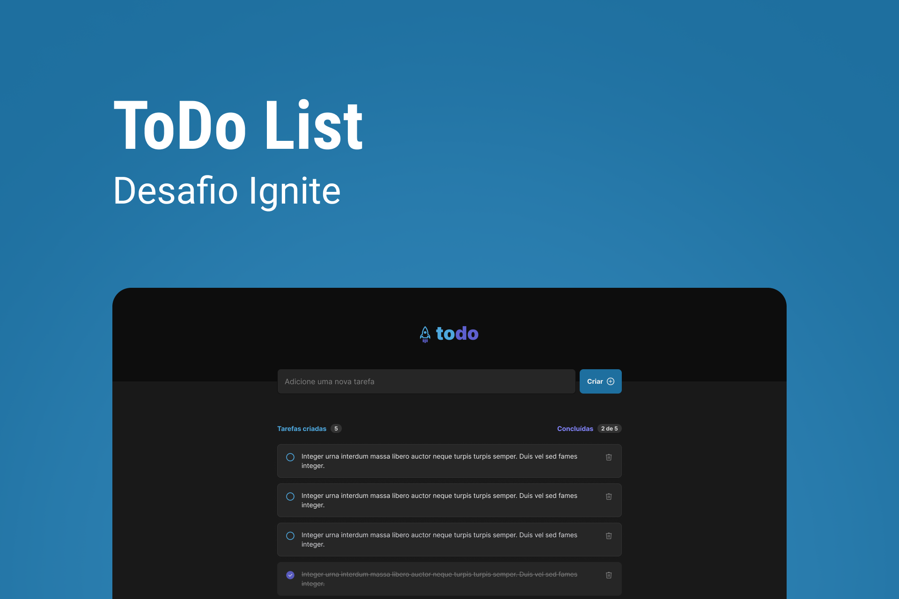

# Ignite To-do

<a href="./LICENSE.md">
    
</a>

</br>



[Click here to see the design](https://www.figma.com/file/m1uWB9iQhAxuOZLPyv9GtB/ToDo-List-(Copy)?node-id=56%3A99&t=WlejXiZHaqA4X2yf-0) you need to have an account on [Figma](https://www.figma.com/).

## 💻 About this project

This challenge was part of the Rocketseat Ignite program, aimed at practicing key **ReactJS** concepts. I applied state management, state immutability, lists and keys, properties, and componentization.

I'll be happy if you could send me any feedback about the project, code, structure or anything that you can report that could make me better as a developer!

And you can use this project as you wish!

## :octocat: Cloning repo

```bash
    $ git clone https://github.com/bw3sley/ignite-todo.git

    $ cd ignite-todo 
```

## :octocat: Installing dependencies

```bash
    npm i
```

## :octocat: Running the project

```bash
    npm run dev
```

## 🚀 Built with

This project was built with:

- Vite
- ReactJS
- TypeScript
- CSS

## 📩 Reach me out

You can reach me at:

Reach me at: bw3sley@gmail.com

Connect with me at [LinkedIn](https://www.linkedin.com/in/bw3sley)

## 📝 License

This project is licensed under the MIT License - see the [LICENSE.md](./LICENSE.md) file for details.